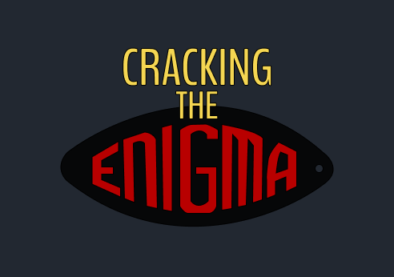

# Cracking The Enigma

  

Enigma was a machine used during World War II to encrypt radio messages. This playground is an simulator, made entirely in Swift, which mimics the mechanics of operation of an original Enigma Machine!

## Configure the machine and decrypt the secret message!

   
  

## Also, do your OWN messages!

  

